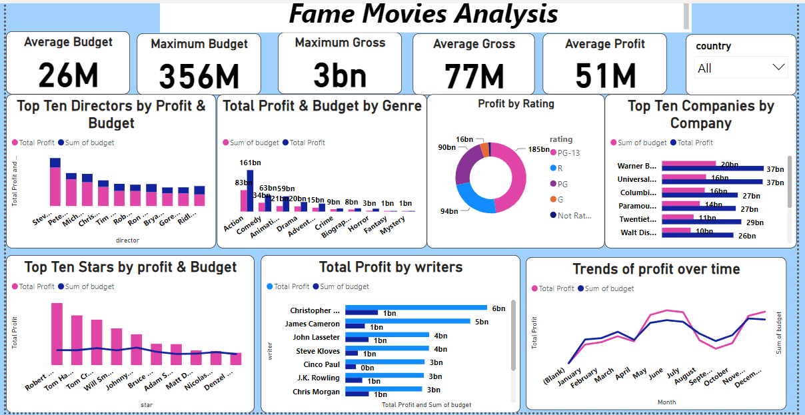
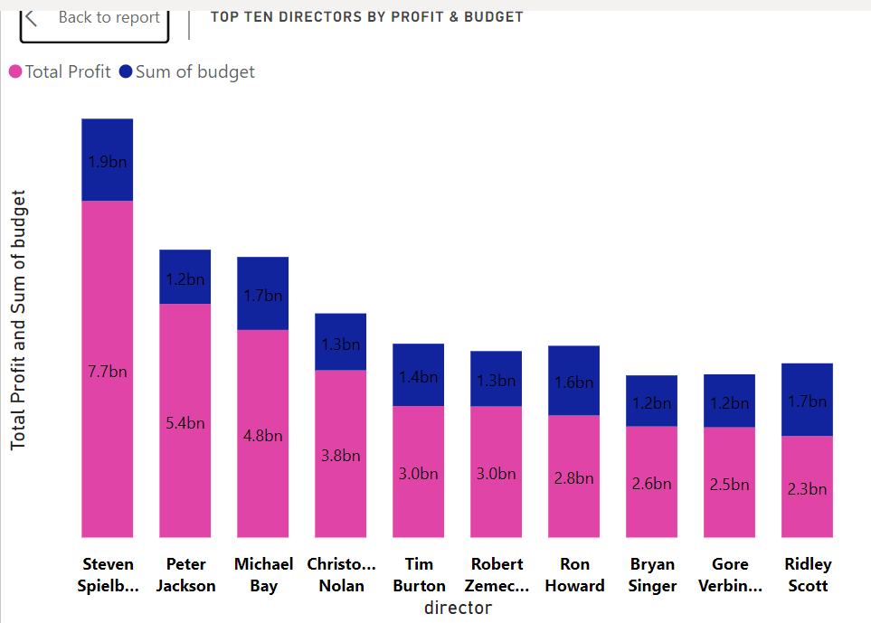
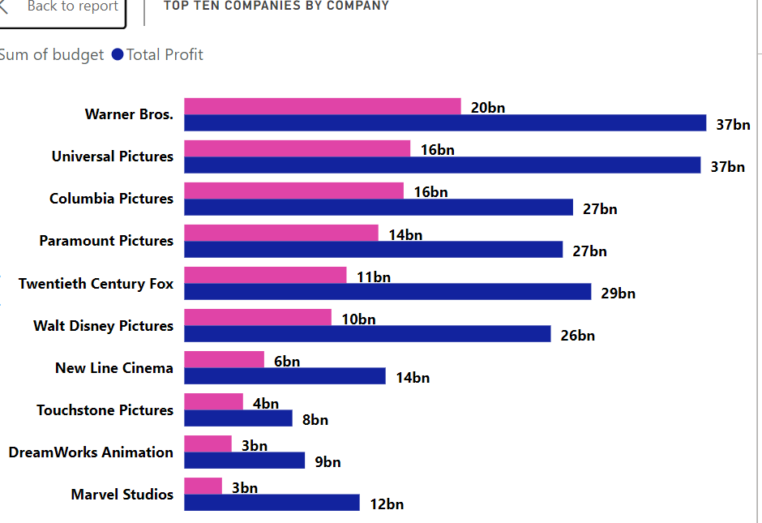
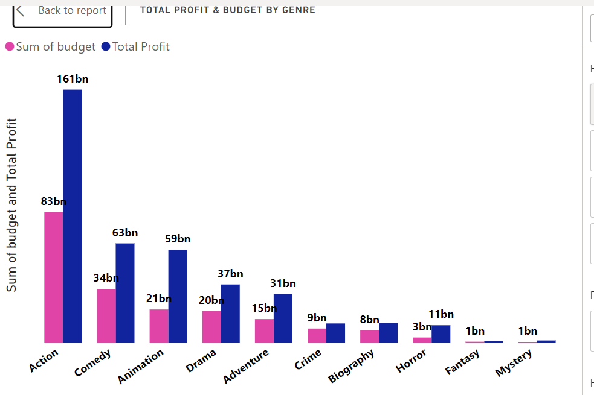
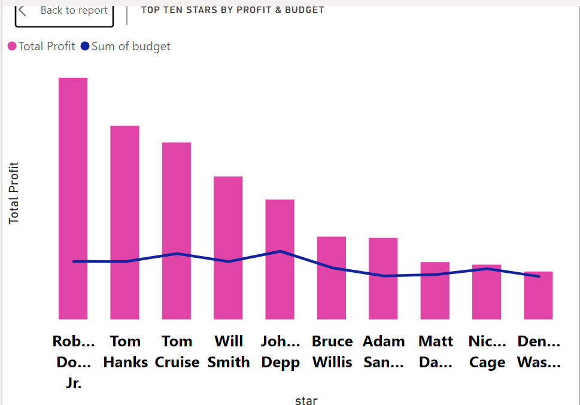
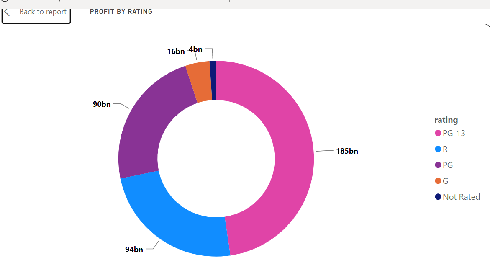
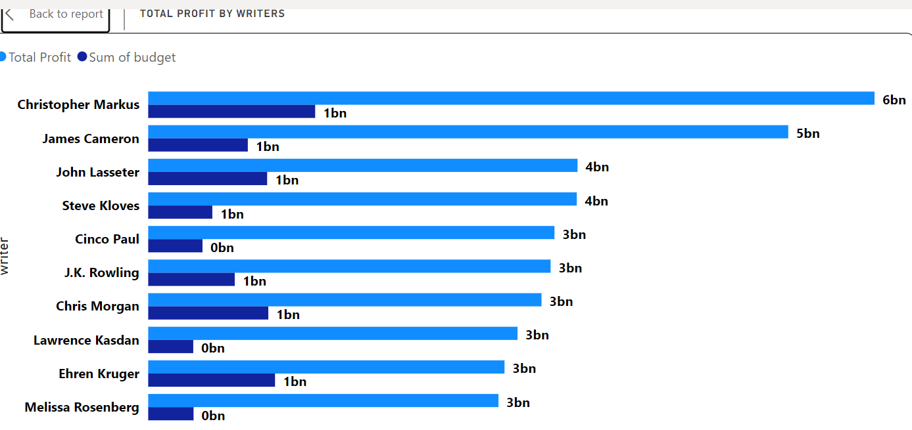
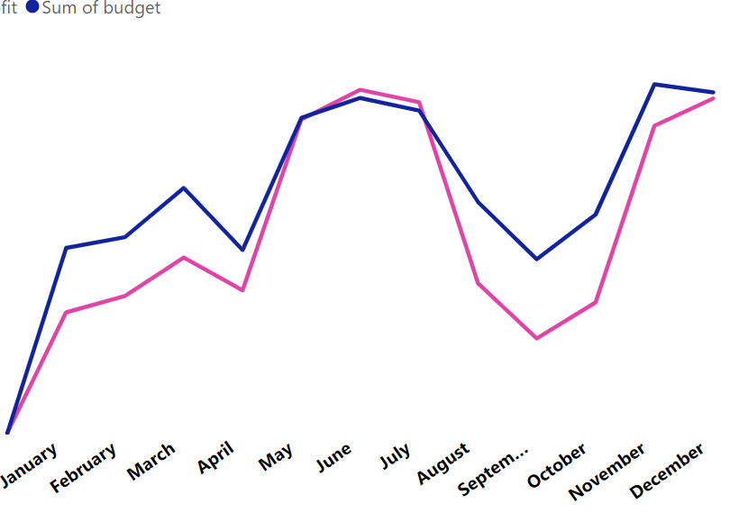

# Fame-Movies-Report

## Introduction
***
Fame is a movie production company that was launched 3 years ago.

 Over the last two years, they produced two movies which led to a huge loss for the company.

 The company plans on producing another movie which will hopefully generate better revenue for them so as to avoid the same financial crisis they faced in previous years.
#### -Datasource
The dataset provided can be found on Kaggle. You can find more information on the data from
https://www.kaggle.com/datasets/danielgrijalvas/movies
***
## Problem statement

The objective of this project is to analyze the data provided by fame, create insights and provide recommendations that will help them achieve their goal which is to make  profit out of their next movie venture.
***

The following are the objective to be achieved from this analysis

-To help them determine the stars to feature in the movie that will enable them to maximize profit.

-To help them determine the best companies to work with.

-To help them know the movies with the highest ratings to work with.

-To help them determine the genre of movies viewers prefer to watch, the budget and profit that can be yielded from them, and the best ones to opt for.

-And finally, to determine the best directors to work with and the best time of the year to release a movie.

## Dataset
***
The dataset provided contains 15 columns and 7657 rows of information on important variables which are determinants of a credible analysis for the company to make decisions. 

-Features of the dataset include;

-Budget: the budget of a movie. 

-Company: the production company

-Country: country of origin
 
-Director: the director
 
-Genre: main genre of the movie.

-Gross: revenue of the movie

-Name: name of the movie

-Rating: the rating of the movie (R, PG, etc.)

-Released: release date (YYYY-MM-DD)

-Runtime: duration of the movie

-Score: IMDb user rating
 
-Votes: number of user votes

-Star: main actor/actress
 
-Writer: writer of the movie
 
-Year: year of release

## Data Cleaning
 ***
After checking through the data, cleaning was done on some of the columns and Data analytics expression(DAX) was incorporated.

Cleaning was carried out on the following column;

-The budget: The column had null values which represented movies without a budget and were replaced with zero (0).

-The gross column also had null values for movies without earnings and was also replaced with zero(0).

-The release column had other information that was not needed in our analysis and was split to get the needed information, the data type was also changed.

-The gross column was subtracted from the budget column to get profit, and this was done using the custom column.

-Measures were also created to get the average and maximum budget as well as average and maximum gross.

## Dashboard
***
Below is the Visualization of insights derived from the dataset

***
#### Colour pink - Profit
#### Colour Blue - Budget

## Analysis
***
### TOP TEN DIRECTORS BY BUDGET AND PROFIT 

This chart shows the budget allocated to each director compared to the amount of profit they will probably yield. 

The blue part of the chart represents the budget of each director, while the pink part indicates their profit.

from the visulized chart, we can see that the most sort after directors include; Steven spielberg, Peter Jacksom, Micheal Bay, Christon Nolan,Tim Burton, Robert Zemeckis,
Ron Howard,Bryan Singer,Gore Verbinski and Ridley Scott. 

### TOP TEN COMPANIES BY BUDGET ABD PRFOIT

This chart shows the budget and profit of top ten companies that the Fame company can work with.
***

### BUDGET AND PROFIT BY MOVIE GENRE

This shows the budget and profit of different movie genre which includes; Action, Comedy, Animation, Drama, Adventure, Crime, Biography, Horror, Fantacy,Mystery.
***
### TOP TEN STARS BY BUDGET AND PROFIT

This chart vizualizes the budgetof to top stars in the US movie industry and their estimated Profits.
The top ten stars include;Robert Downey jr,Tom Hank, Tom Cruise, Will Smith, Johnny Depp, Bruce Willis, Adam Sandler, Matt Damon, Nicholas Cage, Denzel Washington.
***

### PROFIT BY MOVIE RATINGS

The chart shows profit generted by Movie rantings.
The ratings include, Parents Strongly Cautioned(PG 13), Restricted(R), Parental Guidance Suggested(PG), General Audiences (G), Not Rated.
PG-13 had a total profit of 185 billion dollars, R 94billion dollars, PG 90billion dollars, G 16billion dollars while Not rated had 4billion dollars.
***

## TOP TEN WRITERS BY BUDGET AND PROFIT 

This shows Top ten writers by their budget and profit.

The writers include; Christopher Markus, James Cameron,John Lassete, Steve Kloves, Cinco Paul, J.K Rowling, Chris Morgan, Lawrence Kasdan, Ehren Kruger, Melissa Rosenberg.
Also, Christopher,Jmaes and John topped the chart in both profit generated and their estimated budget.
***

### TREND OF MOVIES OVER TIME

This chart shows the trend of movies released over time.
From the pattern of movement on the chart, we can see that there was a sharp hike in the line in both June and November.This indicate that the pfofit level in both months is higher than others
***

## Conclusion & Recommendations
***
-From the analysis, we deduced that the average budget for movies is 26 million, while the maximum budget is 356 million. Therefore, the next movie budget should not exceed this range in order to maximize the expected profit.

-If the proposed budget does not exceed the above range, they will garner a maximum of 3billions and an average of 77 million dollars in gross earnings, making them an average of 51 million dollars in profit after all expenses have been deducted.

-The genre for the movie should be either Action, comedy, or animation. This is because action has a Total of 161 billion profit compared to its 83 billion budget, while comedy has a 63 billion profit to a 34 billion budget, and animation has a 59 billion profit to its 21 billion budget. Each of these genres has a target audience reaching both adults and children, therefore they should be highly considered.

-The director that should be considered for the next production should be Steven Spielberg, Peter Jackson, and Micheal Bay. Amongst all three of them, Spielberg is the highest-paid and the most popular. However, he will yield approximately 7.7 billion in profit for featuring in the movie while Peter Jackson and Michael Bay will make 5.4 and 4.8 billion respectively, which makes them the best perfect fit to maximize profit in the next production.

-Stars that should be featured should include Rob Downey, Tom Hank, Tom Cruise, and Will Smith. This is because of all the stars included in the data, these are the stars with more profit margin compared to the budget allocated to them. Also, a lot of people are sentimental about these actors and will probably watch the movie just because they are in it.

-The Movies ratings to be considered for the next movie should be between (parents strongly cautioned)PG-13, R( Restricted), and PG (parental guidance suggested). However, PG-13 and  PG should be highly considered because they'll yield more profit than R for the company.

The production and distribution company that should be used is universal pictures, twentieth fox, and Walt Disney Pictures. The reason for choosing these companies is that compared to the other companies, their estimated budget is lesser and they'll yield a reasonable amount of profit for the company.

Finally, while looking through how movies have performed over the years, we deduced that the best time of the year to release a movie is between June and November. Although other countries had higher profits in other months. however, the United Kingdom and the United States which are the biggest market for this company yielded more profit during this period, therefore they should be highly considered while making decisions on months of a movie release.

